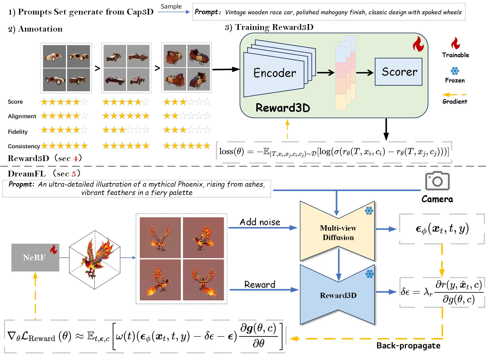
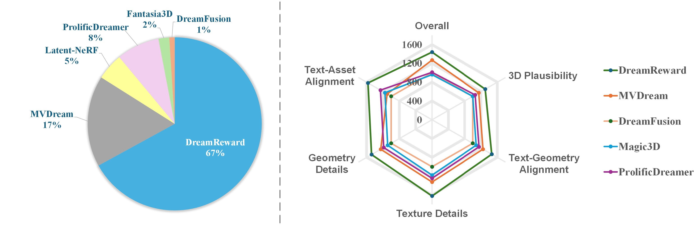
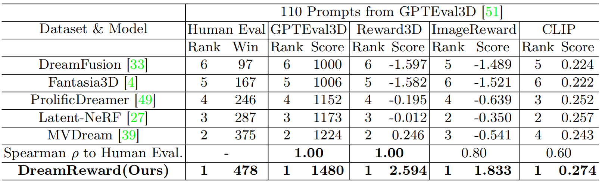

# DreamReward: Text-to-3D Generation with Human Preference
[**Paper**](http://arxiv.org/abs/2403.14613) | [**Project Page**](https://jamesyjl.github.io/DreamReward/) 
<p align="left">
    <a href="https://jamesyjl.github.io/">Junliang Ye</a><sup>*</sup></a><sup>1,</sup></a><sup>2</sup>, 
    <a href="https://liuff19.github.io/">Fangfu Liu</a><sup>*1</sup>, 
    Qixiu Li</a><sup>1</sup>, 
    <a href="https://thuwzy.github.io/">Zhengyi Wang</a><sup>1,2</sup>, 
    <a href="https://yikaiw.github.io/">Yikai Wang</a><sup>1</sup>, 
    Xinzhou Wang</a><sup>1,2</sup>, 
    <a href="https://duanyueqi.github.io/">Yueqi Duan</a><sup>1,&#x2709</sup>, 
    <a href="https://ml.cs.tsinghua.edu.cn/~jun/index.shtml">Jun Zhu</a><sup>1,2,&#x2709</sup>
</p>
<p align="left"><sup>1</sup>Tsinghua University &ensp; <sup>2</sup>ShengShu&ensp; <sup>*</sup> Equal Contribution<sup>&ensp; &#x2709</sup>  Corresponding Author</p>

<p align="center"> Our Code will be released soon... 🏗️ 🚧 🔨</p>

Abstract: *3D content creation from text prompts has shown remarkable success recently. However, current text-to-3D methods often generate 3D results that do not align well with human preferences. In this paper, we present a comprehensive framework, coined DreamReward, to learn and improve text-to-3D models from human preference feedback. To begin with, we collect 25k expert comparisons based on a systematic annotation pipeline including rating and ranking. Then, we build Reward3D---the first general-purpose text-to-3D human preference reward model to effectively encode human preferences. Building upon the 3D reward model, we finally perform theoretical analysis and present the Reward3D Feedback Learning (DreamFL), a direct tuning algorithm to optimize the multi-view diffusion models with a redefined scorer. Grounded by theoretical proof and extensive experiment comparisons, our DreamReward successfully generates high-fidelity and 3D consistent results with significant boosts in prompt alignment with human intention. Our results demonstrate the great potential for learning from human feedback to improve text-to-3D models.*

<p align="center">
    
</p>

## Comparison with MVDream
<p align="center">
    
</p>

## More Visual Results
<p align="center">
    
</p>

## Quantitative Comparison
We compared our DreamReward on 110 prompts generated by GPTEval3D.
<b>Left</b>: User study of the rate from volunteers’ preference for each method in the inset pie chart, <b>Right</b>: Holistic evaluation using GPTEval3D.
<p align="center">
    
</p>

We compared our DreamReward with DreamFusion, ProlificDreamer, Latent-NeRF, MVDream, and Fantasia3D. We calculate CLIP↑, ImageReward↑, GPTEval3D ↑ and Reward3D↑.
<p align="center">
    
</p>

## BibTeX


```bibtex
@misc{ye2024dreamreward,
      title={DreamReward: Text-to-3D Generation with Human Preference}, 
      author={Junliang Ye and Fangfu Liu and Qixiu Li and Zhengyi Wang and Yikai Wang and Xinzhou Wang and Yueqi Duan and Jun Zhu},
      year={2024},
      eprint={2403.14613},
      archivePrefix={arXiv},
      primaryClass={cs.CV}
}
```
